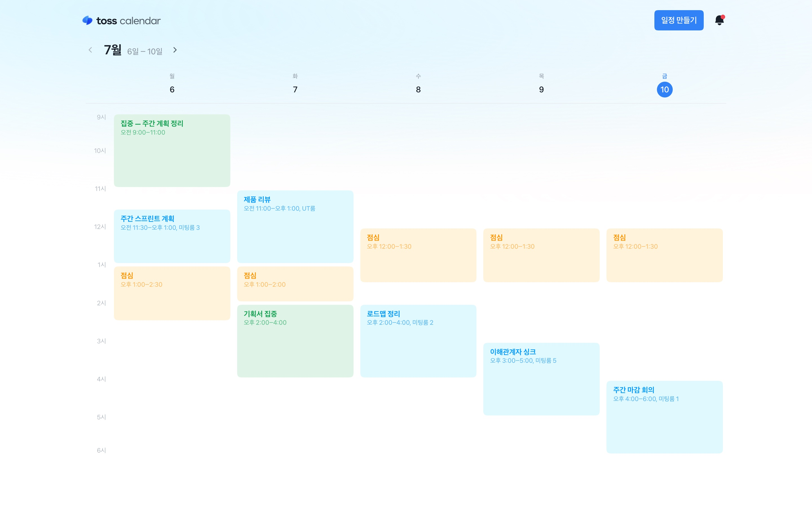
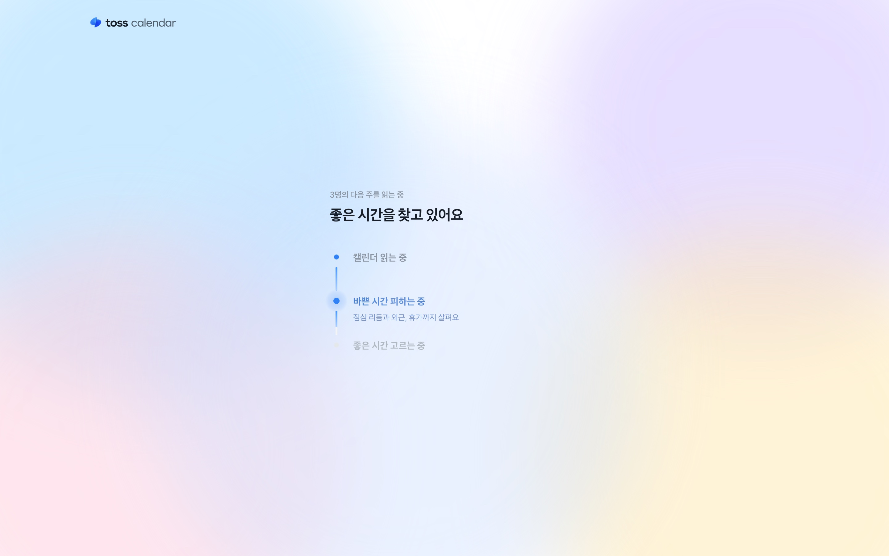
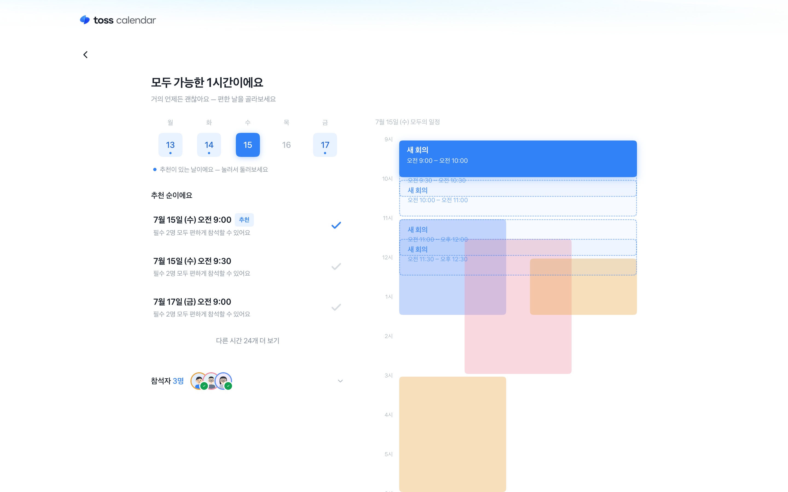
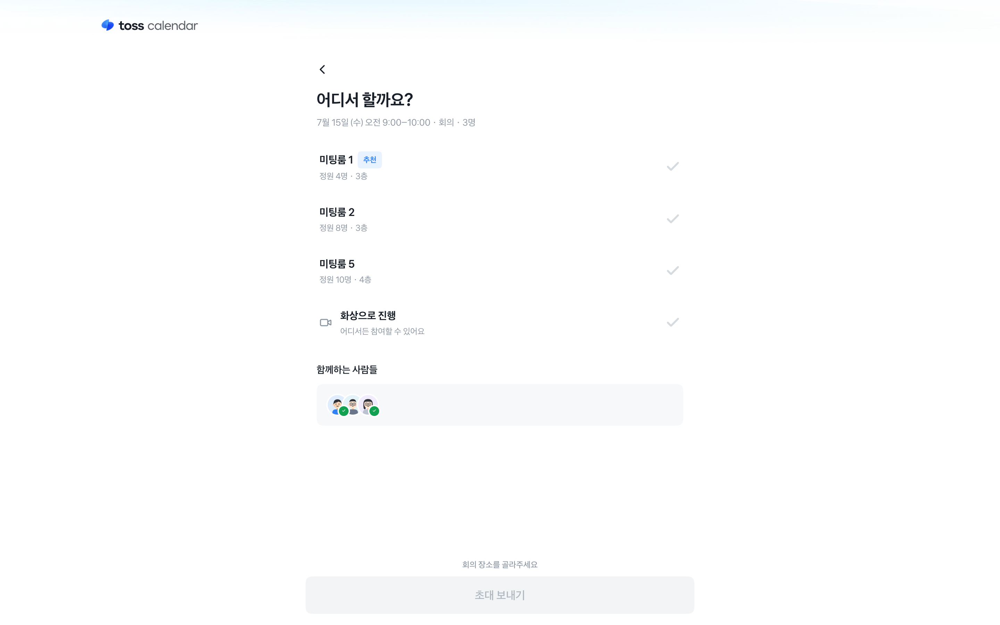
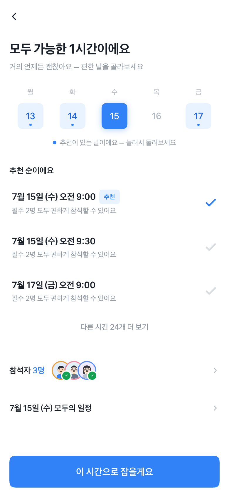
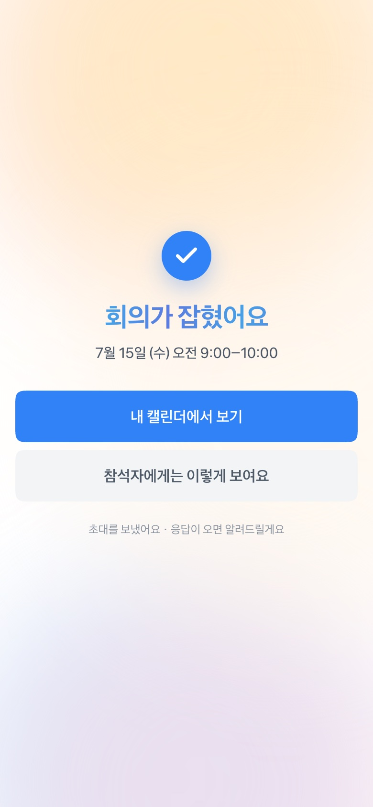

# toss calendar

> 알아서 맞춰주는 회사 캘린더 — 회의 하나를 잡을 때, 동료들의 하루를 먼저 읽습니다.

**[▶ 라이브 데모 — toss-calendar.vercel.app](https://toss-calendar.vercel.app)**

피그마 목업이 아니라 실제로 동작하는 웹앱입니다. PC와 모바일 모두에서 열어보세요.
날짜는 언제 열어도 **진짜 오늘** 기준으로 살아 움직입니다.



## 과제

> 같은 회사 동료 6명이 다음 주까지 모여야 해요. 회의 시간은 딱 1시간.
> 누군가는 점심 직후를 피하고 싶고, 어떤 사람은 특정 요일에 외근이 많아요.
> 꼭 참석해야 하는 사람도, 참석하면 좋은 사람도 있어요.

## 문제 정의 — 조율은 계산이 아니라 배려다

캘린더에서 "겹치지 않는 칸"을 찾는 건 계산이고, 도구는 이미 잘합니다.
그런데 회의 잡기가 여전히 괴로운 이유는 빈 칸 뒤에 있는 것들 때문입니다.

- **빈 시간 ≠ 좋은 시간.** 점심 직후의 나른함, 외근 날의 이동, 연속 회의의 피로는 캘린더에 빈 칸으로 보입니다.
- **안 되는 시간엔 이유가 없다.** "이 시간 안 돼요"만 오가면, 잡는 사람은 눈치 게임을 하고 받는 사람은 통보를 받습니다.
- **부분 참석은 협상의 사각지대.** "30분만 와줄 수 있어요?"는 도구 밖 메신저에서 벌어집니다.

그래서 이 앱은 시간을 **추천할 때마다 사람 이름과 이유를 함께** 말하고,
안 되는 시간은 정직하게 안 된다고 말하고, 부분 참석은 당사자의 허락을 먼저 구합니다.
받는 사람의 초대장에도 같은 이유가 담깁니다 — 배려가 전달되는 순간까지가 조율입니다.

## 사용 흐름

**여정 A — 회의 잡기** (주최자)

1. **홈** — 내 주간 캘린더. 일정 종류가 곧 색입니다.
2. **셋업** — 무엇을, 누구와, 얼마나, 언제까지. 혼자면 바로 캘린더에 저장되고, 함께면 시간 찾기로 이어집니다.
3. **스캔 모먼트** — 참석자들의 다음 주를 읽는 시간. 무엇을 살피는지(점심 리듬, 외근, 휴가) 화면이 직접 말합니다.
4. **시간 찾기** — 추천 순 리스트 + 그날 모두의 일정 타임라인. 점선 카드는 다른 후보 — 눌러서 갈아탈 수 있습니다.
5. **어디서 할까요** — 회의실 추천, 모두를 위한 조정(50분으로 줄이기 등), 함께하는 사람들.
6. **완료** — 함께 챙긴 것 요약, 그리고 "참석자에게는 이렇게 보여요" 미리보기.





**여정 B — 초대 받기** (참석자)

홈 캘린더에 점선(응답 대기)으로 살고 있는 받은 초대를 열면, 주최자가 왜 이 시간을
골랐는지 내 이야기가 첫 줄로 옵니다. 참석하거나, 어려우면 사유와 함께 정중히 거절합니다.
응답하면 점선이 실제 일정으로 자리 잡고, 주최자 화면엔 응답 토스트가 도착합니다.

<p>
  
  
</p>

## 심사를 위한 지름길

모든 상태는 URL로 직행할 수 있습니다. (참석자·조건이 URL에 실려 있어 어떤 판이든 재현됩니다)

| 상황 | 바로 가기 |
| --- | --- |
| 과제 시나리오 그대로 — 6명(필수 4 + 선택 2), 1시간, 다음 주까지 | [셋업부터 시작](https://toss-calendar.vercel.app/?p=ichan.r,junho.r,seoyeon.r,minsu.r,haneul.o,sehun.o&d=60&dl=nw&s=setup) |
| 모두 가능한 판 — 추천과 타임라인 | [시간 찾기](https://toss-calendar.vercel.app/?p=ichan.r,junho.o,seoyeon.r&d=60&dl=nw&s=find) |
| 전부 조금씩 아쉬운 판 — "그나마 나은 순" + 이렇게 풀 수도 있어요 | [시간 찾기](https://toss-calendar.vercel.app/?p=ichan.r,junho.r,seoyeon.r,sehun.r,jiwoo.r,daon.r&d=60&dl=nw&s=find) |
| 후보가 없는 판 — 정직한 부재와 완화 제안 | [시간 찾기](https://toss-calendar.vercel.app/?p=ichan.r,junho.r,seoyeon.r,sehun.r,jiwoo.r,daon.r&d=60&dl=tw&s=find) |
| 받은 초대 — 여정 B | [초대 열기](https://toss-calendar.vercel.app/?s=invite) |

## 설계 결정 몇 가지

- **라이브 앵커.** 세계의 모든 날짜가 "오늘" 기준 상대 좌표입니다. 심사하는 날이 언제든 오늘은 오늘이고, 다음 주는 다음 주입니다.
- **추천의 서열은 참석 완전성이 정합니다.** 모두 온전히 참석할 수 있는 시간은 어떤 편의 보너스로도 뒤집히지 않습니다. 그 아래에서 "30분이라도 함께"가 "아예 못 옴"을 항상 이깁니다.
- **부분 참석은 허락제.** 꼭 참석할 사람을 시스템이 마음대로 반쪽 참석시키지 않습니다 — 후보가 없을 때, 당사자에게 허락을 구하는 선택지로만 제안합니다.
- **색의 문법은 화면의 질문을 따릅니다.** 내 캘린더는 "무슨 일정인가"라서 종류색, 모두의 일정은 "누가 안 되는가"라서 사람색입니다.
- **모션은 토스 실물을 실측해 재현했습니다.** 바텀시트 캐스케이드는 토스 앱 녹화를 60fps 프레임 단위로 분석해 옮겼습니다 — 행마다 다른 초기 오프셋과 지연 스프링이 "위에서부터 쌓이는" 손맛을 만듭니다.
- **완료는 끝이 아닙니다.** 초대가 어떻게 보이는지 미리 보여주고, 응답이 돌아오는 순간(토스트·알림·캘린더 반영)까지 설계했습니다.

## 만든 방법

Next.js (App Router) · React · TypeScript · Tailwind CSS v4 · Motion · Vitest

- 스케줄링 엔진은 순수 함수 파이프라인입니다: 하드 필터(근무시간·불가 일정) → 배려 점수(점심 리듬·외근·연속 회의) → 이유 생성 → 심각도 계층 정렬. 유닛 테스트 347개가 계약을 지킵니다.
- 외부 API·DB 없음 — 동료 20명의 일주일이 코드에 내장된 시뮬레이션 월드입니다(`src/data/world.ts`).
- AI 도구(Claude Code)와 페어로 설계·구현했습니다.

## 실행

```bash
npm install
npm run dev        # http://localhost:3000
```

```bash
npx vitest run     # 엔진·상태 유닛 테스트 (347)
npx tsc --noEmit   # 타입 체크
```
