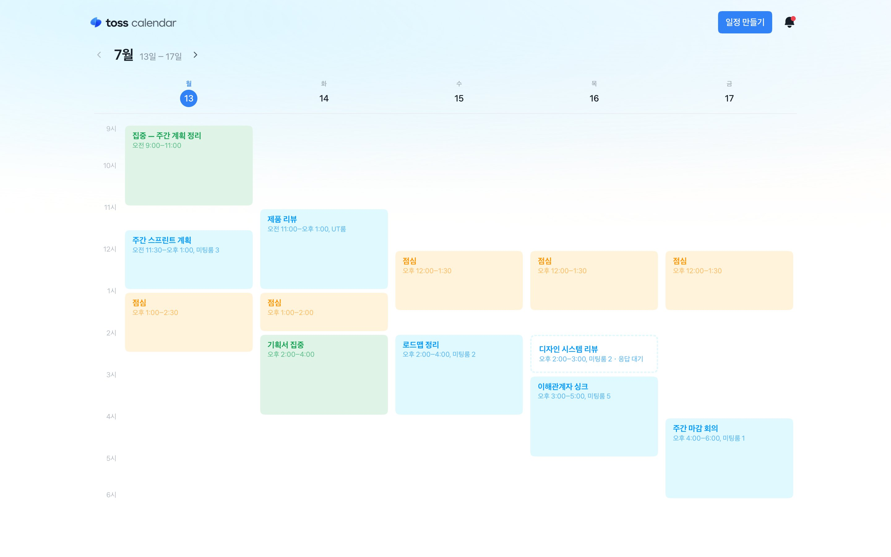
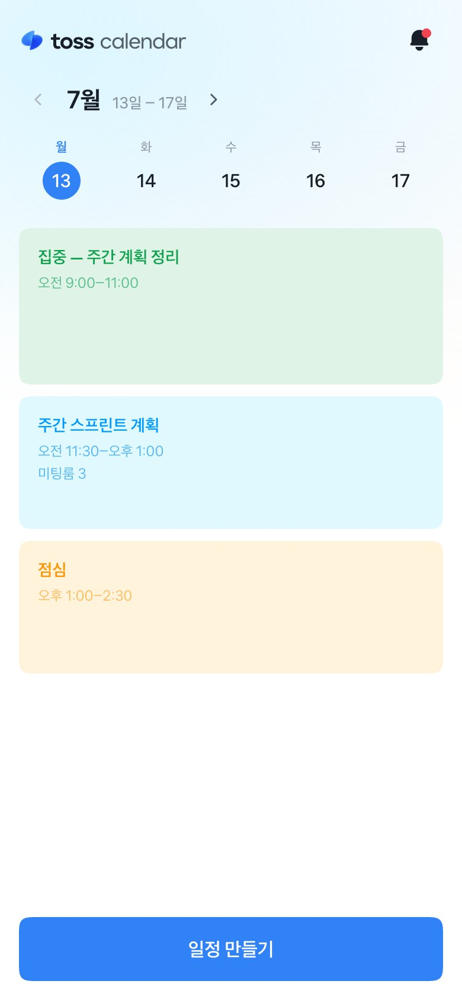
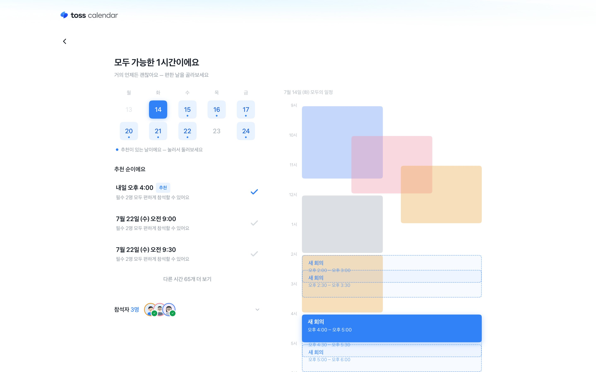
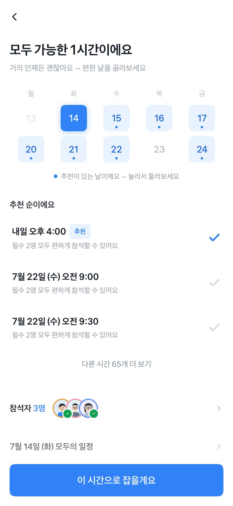

# toss calendar

> 알아서 맞춰주는 회사 캘린더. 회의 하나를 잡을 때, 동료들의 하루를 먼저 읽습니다.

**[▶ 라이브 데모 · toss-calendar.vercel.app](https://toss-calendar.vercel.app)**

실제로 동작하는 웹앱입니다. **PC와 모바일 모두 대응**하니 두 기기에서 그대로 열어보세요.
날짜는 언제 열어도 **진짜 오늘** 기준으로 살아 움직입니다.

## 과제

> 같은 회사 동료 6명이 다음 주까지 모여야 해요. 회의 시간은 딱 1시간.
> 누군가는 점심 직후를 피하고 싶고, 어떤 사람은 특정 요일에 외근이 많아요.
> 꼭 참석해야 하는 사람도, 참석하면 좋은 사람도 있어요.

## 문제 정의 · 좋은 회의는 좋은 시간에서 시작된다

회의를 잡을 때마다 같은 대화가 반복됐습니다. "저는 그때 어려워요",
"그 시간보다는 이 시간이 나아요." 조율은 늘 메신저를 오가는 눈치 게임이었고,
저는 이걸 어떻게 풀 수 있을까를 오래 생각했습니다.

조율의 전제는 참석자 모두의 일정을 아는 것입니다. 하지만 일정을 안다고 끝나지
않습니다. 캘린더의 빈 칸이 곧 좋은 시간은 아니기 때문입니다. 점심 직후는 누구나
힘들고, 어떤 사람은 앞뒤 일정 때문에 30분밖에 낼 수 없습니다. 기존 도구는
"가능한 시간"을 계산해줄 뿐, "좋은 상태로 모일 수 있는 시간"은 묻지 않습니다.

여기서 회의의 목적으로 돌아갔습니다. 회의는 모이는 것 자체가 아니라
**함께 좋은 방향으로 나아가기 위한 일**입니다. 그렇다면 시간 선택은 일정 관리가
아니라 회의 품질의 문제입니다. 모두가 조금 더 좋은 상태로 앉아야 좋은 결과가
나옵니다. 꼭 참석할 사람들의 시간이 축이 되어야 하고, 선택 참석자는 잠깐이라도
함께하는 것이 의미 있습니다. 안건의 흐름을 공유하는 30분이, 아예 못 오는 것보다
회의를 좋게 만들기 때문입니다.

그래서 이 제품은 조율 도구가 아니라 **캘린더**입니다. 회의는 캘린더에서 태어납니다.
혼자면 개인 일정이 되고, 참석자를 더하는 순간 단체의 일이 됩니다. 그 순간부터
캘린더가 참석자들의 하루를 대신 읽고, 배려가 담긴 시간을 이유와 함께 추천합니다.
모두를 위한 캘린더가 아니라, **더 좋은 결과로 가기 위한 더 좋은 시간을 찾는
캘린더**입니다.

## 경험을 설계한 방식

**이유가 신뢰를 만듭니다.** 모든 추천에는 "필수 2명 모두 편하게 참석할 수 있어요",
"박준호님은 뒤 30분만 함께할 수 있어요"처럼 사람 이름과 근거가 붙습니다.
시스템이 왜 이 시간을 골랐는지 알 수 있어야, 그 시간을 믿고 보낼 수 있습니다.

**상황이 다르면 화면의 문법도 다릅니다.** 모두 가능한 날은 달력과 추천이 나란히 서고,
전부 조금씩 아쉬운 날은 "그나마 나은 순"이라고 정직하게 말을 바꿉니다.
후보가 아예 없으면 없는 것을 있는 척 그리지 않습니다. 달력을 치우고
"기한을 다음 주까지로 미뤄요" 같은 다음 수를 제안하는 무대로 전환됩니다.

**백지 선택을 시키지 않습니다.** 시간 찾기에 들어서면 1위 후보가 이미 골라져 있습니다.
사용자는 0에서 고르는 게 아니라, 좋은 기본값에서 출발해 취향만 조정합니다.
장소만은 예외로 비워뒀습니다. 회의실은 조직마다 사정이 달라서, 추천 배지만 달고 선택은 맡깁니다.

**꼭 참석할 사람을 시스템이 반쪽 참석시키지 않습니다.** 부분 참석은 후보가 없을 때
"한도윤님이 일부만 함께하면 돼요"라는 허락제 제안으로만 등장합니다. 수락하면 초대장에
"뒤 30분만 함께해도 충분해요" 문구와 안건 배치 추천, 퇴장 5분 전 알림까지 함께 챙깁니다.

**받는 사람의 경험까지가 조율입니다.** 보내기 전에 "참석자에게는 이렇게 보여요"로
상대 화면을 미리 보고, 받은 사람의 초대장엔 자기 이야기가 첫 줄로 옵니다.
거절도 존중받습니다. "어려워요"를 누르면 사유와 함께 정중하게 전달되고,
주최자에겐 응답이 토스트와 알림으로 돌아옵니다.

## 디자인과 인터랙션은 제품에서 확인해주세요

디자인과 인터랙션은 글로 설명하는 대신 제품에 담았습니다. 홈에서 시작해 회의 하나를
직접 잡아보며 천천히 따라와 주세요. 화면이 이어지는 호흡, 시간을 찾는 동안의 기다림,
확정되는 순간의 온도까지 모두 의도한 장면입니다.

<p align="center">
  
</p>
<p align="center"><sub>시간을 찾는 동안의 스캔 모먼트. 스피너 대신 지금 무엇을 살피는지 말합니다.</sub></p>

그리고 꼭 **PC와 모바일 두 기기 모두에서** 열어봐 주세요. 하나의 제품을 반응형으로,
같은 정보를 기기에 맞는 문법으로 다시 설계했습니다. PC에서 누른 자리 곁에 열리던
선택지가 모바일에서는 바텀시트로 올라옵니다. 시트가 위에서부터 차곡차곡 쌓이는 모션과
아래로 쓸어 닫는 손맛까지, 토스의 감각을 프레임 단위로 살펴 옮겼습니다.

<p>
  
  
</p>
<p align="center"><sub>홈. PC는 월~금 주간 그리드, 모바일은 요일 칩과 하루 목록.</sub></p>

<p>
  
  
</p>
<p align="center"><sub>시간 찾기. PC는 추천과 모두의 일정 타임라인을 나란히, 모바일은 추천에 집중하고 타임라인은 시트로.</sub></p>

## 이렇게 걸어보세요

홈에서 **일정 만들기**로 시작해 참석자를 더하고, 추천 중 하나를 골라 초대를 보내보세요.
홈으로 돌아오면 잠시 뒤 **동료들의 응답이 토스트로 도착**합니다.
그리고 홈 캘린더에 점선으로 서 있는 **받은 초대**를 열어보세요. 이번엔 받는 입장이 됩니다.

## 핵심 장면 바로 가기

처음부터 걸어도 좋지만, 보고 싶은 장면으로 바로 갈 수도 있습니다.
참석자와 조건이 URL에 담겨 있어 어떤 장면이든 그대로 재현됩니다.

| 장면 | 바로 가기 |
| --- | --- |
| 과제 시나리오 그대로 · 6명(꼭 참석 4, 선택 2), 1시간, 다음 주까지 | [셋업부터 시작](https://toss-calendar.vercel.app/?p=ichan.r,junho.r,seoyeon.r,minsu.r,haneul.o,sehun.o&d=60&dl=nw&s=setup) |
| 모두 가능한 시간이 있는 날 · 추천과 모두의 일정 타임라인 | [시간 찾기](https://toss-calendar.vercel.app/?p=ichan.r,junho.o,seoyeon.r&d=60&dl=nw&s=find) |
| 전부 조금씩 아쉬운 날 · "그나마 나은 순"과 이렇게 풀 수도 있어요 | [시간 찾기](https://toss-calendar.vercel.app/?p=ichan.r,junho.r,seoyeon.r,sehun.r,jiwoo.r,daon.r&d=60&dl=nw&s=find) |
| 모두가 편한 시간이 없는 날 · 정직하게 말하고 다음 수를 제안해요 | [시간 찾기](https://toss-calendar.vercel.app/?p=ichan.r,junho.r,seoyeon.r,sehun.r,jiwoo.r,daon.r&d=60&dl=tw&s=find) |
| 초대를 받는 입장 · 이유가 담긴 초대장과 응답 | [초대 열기](https://toss-calendar.vercel.app/?s=invite) |
| 혼자면 바로 캘린더에 · 개인 일정 만들기 | [일정 만들기](https://toss-calendar.vercel.app/?p=ichan.r&d=60&dl=nw&s=setup) |

## 로컬 실행

```bash
npm install && npm run dev   # http://localhost:3000
```
